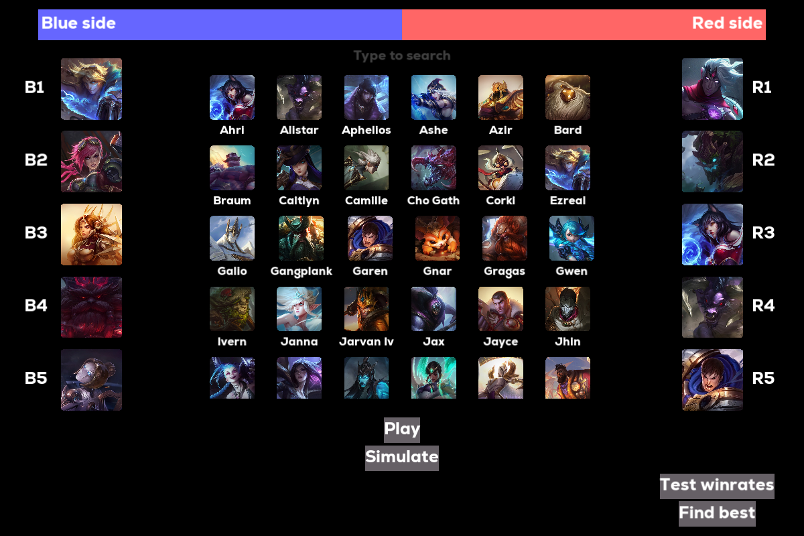
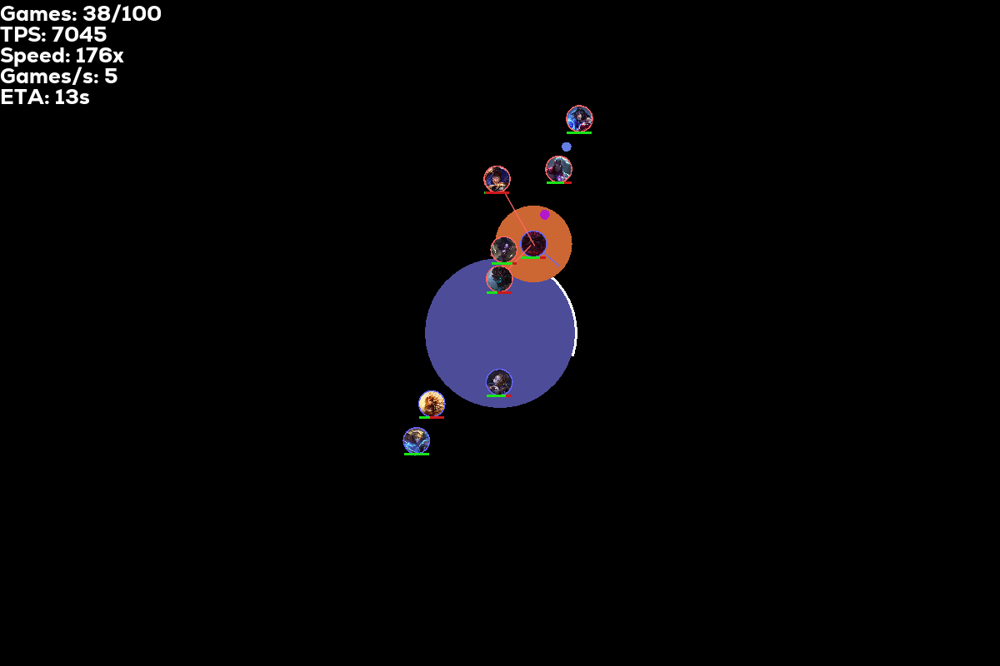
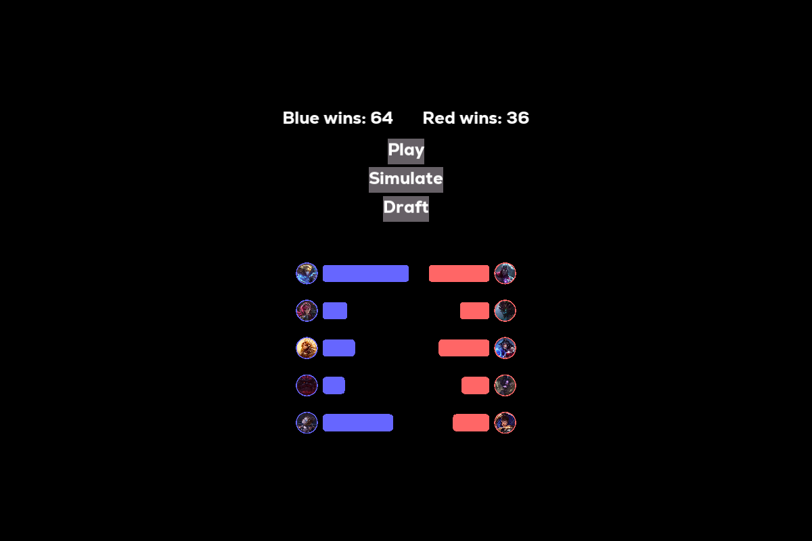

# lol_draft_sim

**lol_draft_sim** lets you draft teams and simulate the result of them teamfighting. It aims to improve our feel for drafting by visualising the thematical differences between the selected champions.


### Draft stage



### Simulation



### Result



## Running the program

1. Install the [LÖVE game engine](https://love2d.org/) (< 10MB)

Test if it works with the `love` command

2. Clone the repository

```
git clone https://github.com/BartiX259/lol_draft_sim.git
cd lol_draft_sim
```

3. Run the program

```
love .
```

## Making champions

Champions are located in the `champions` directory. They are made in a custom language to simplify their creation. You will need [python](https://www.python.org/) to compile the files:

```
python scripts/compile_champ.py champions/*.champ -o champions/lua/
```
or
```
python run.py
```
to compile and run.

### Workflow with helper scripts

I made some scripts that make creating champions easier. This is the streamlined process:

1. Make sure you have the right python modules installed

```
pip install -r requirements.txt
```

2. Get an api key from [AI Studio](https://aistudio.google.com/apikey) and paste it into `key.txt`

3. Run `scripts/make_champ.py`, for example

```
python scripts/make_champ.py jinx aa w e r -e "Assume she has her q on"
```

4. Download the champion's splash art

```
python scripts/splash_art.py champions/jinx.champ
```

5. Adjust and fix the `.champ` file

6. Generate the stats

```
python scripts/gen_stats.py champions/jinx.champ
```
7. Balance the champion by running the program and using the `Test winrates` button, adjusting the stats and repeating. The winrate of all champions should be between 45%-55%.

